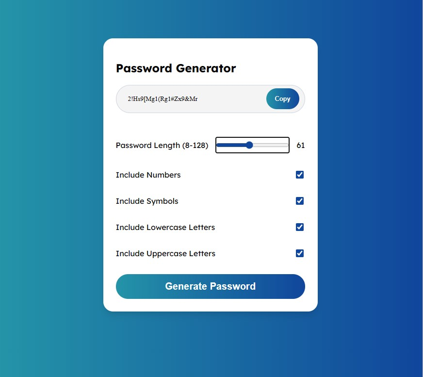

# Password Generator

## Description 

A random password generator that allows for the user to set their own criteria for generating a random string of characters for a password. 

The criteria the user can set is: 
- Length from 8 to 128 characters
- Whether to use numbers
- Whether to use symbols
- Whether to use uppercase characters
- Whether to use lowercase characters

The user can also copy the result and save it somewhere else.

## Website Link

[Password Generator](https://roamingheart.github.io/pass-gen/)

## Website Preview

## Requirements for the Project

GIVEN I need a new, secure password
WHEN I click the button to generate a password
THEN I am presented with a series of prompts for password criteria
WHEN prompted for password criteria
THEN I select which criteria to include in the password
WHEN prompted for the length of the password
THEN I choose a length of at least 8 characters and no more than 128 characters
WHEN asked for character types to include in the password
THEN I confirm whether or not to include lowercase, uppercase, numeric, and/or special characters
WHEN I answer each prompt
THEN my input should be validated and at least one character type should be selected
WHEN all prompts are answered
THEN a password is generated that matches the selected criteria
WHEN the password is generated
THEN the password is either displayed in an alert or written to the page

## Credits

The MSU Bootcamp provided the base code for the project.

I learned most of the code from [Andy Leverenz](https://tutsplus.com/authors/andy-leverenz?_ga=2.166433662.1971619009.1681630444-1242380265.1681630444) at [Web Design Evanto Tuts+](https://webdesign.tutsplus.com/tutorials/build-a-configurable-random-password-generator-with-javascript--cms-93262).

Leverenz, Andy. “Build a Configurable Random Password Generator with JavaScript.” Web Design Envato Tuts+, Envato Tuts, 26 Sept. 2022, https://webdesign.tutsplus.com/tutorials/build-a-configurable-random-password-generator-with-javascript--cms-93262. 

## Liscense 
Please refer to the LISCENSE in the repo.
